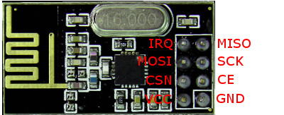

# RF24Sensors
A collection of Arduino based sensors using the nRF24L01 radio module. The collection includes an Arduino based Interface device that receives and transmits messages from/to the sensors and is connected to a Raspberry Pi or any other controller via a USB.

The sensors implement a subset of the 11 character LLAP messages as originally used by Ciseco/ Wireless Things devices. All messages are 11 characters and begin with a lowercase 'a' followed by a 2 character device id. The remainder of the message is device specific e.g. aABTEMP21.4.

Only a subset of the full list of LLAP messages is required as many of them were only used for device configuration. These sensors are configured by tailoring the Arduino sketch that is loaded to the device. For example a temperature device only requires two messages:
- aXXTEMPnn.n or aXXTEMP-n.n
- aXXBATTn.nn

## Connecting the radio

The following connections apply to and have been tested on a Uno, Nano and Pro Mini 3.3V.

Arduino | nRF24L01
------- | --------
GND | GND
3.3V | VCC
7\* | CE
8\* | CSN
13 | SCK
11 | MOSI
12 | MISO
\- | IRQ

\* The pins for CE and CSN are configurable and these are the default values.

## Compiling the sketches

The sketches are compiled and loaded to an Arduino using the standard Arduino IDE. All the sketches require the Arduino RF24 library. This library is included with the IDE but is not enabled by default. To add the library use the Sketch --> Include Library and first check if RF24 is under the Contributed libraries. If not then select Manage Libraries... In the *Filter your search...* field enter RF24. Amongst those listed will be RF24 by TMRh20. Click More info, choose version 1.2.0 and Install.

Various other libraries are required by different sketches and these will be listed in the accompanying document.
